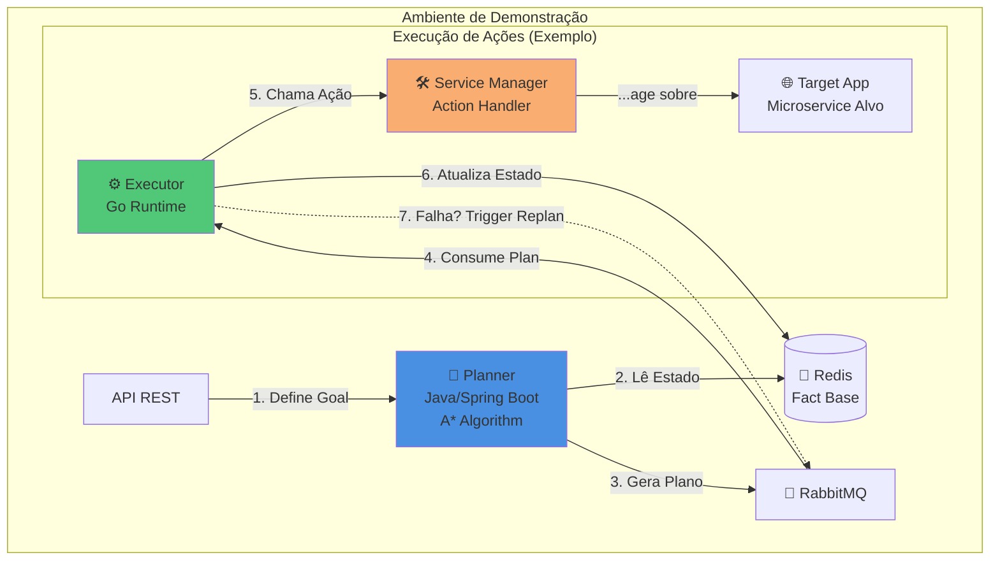

# Adaptive Operations Engine (AOE)
### Explorando AI Planning para Auto-Healing de Microserviços

[](https://opensource.org/licenses/MIT)
[]()

---

## Sobre o Projeto

O **Adaptive Operations Engine (AOE)** é um **estudo aplicado** que explora como técnicas de **AI Planning** — especificamente **GOAP (Goal-Oriented Action Planning)**, comumente usadas em jogos como *F.E.A.R.* e *The Sims* — podem ser aplicadas para criar sistemas de auto-healing adaptativos em ambientes de microserviços.

> **Importante:** Este é um **Proof-of-Concept acadêmico** para exploração de conceitos. Não é uma solução pronta para produção nem pretende substituir ferramentas estabelecidas como Temporal.io, Kubernetes Operators ou Apache Airflow.

### Objetivo do Estudo

Investigar **quando e como** sistemas baseados em planejamento automatizado podem complementar ferramentas tradicionais de orquestração em cenários de alta complexidade onde múltiplos caminhos de recuperação são possíveis.

---

## Contexto: Por Que Explorar Planejamento Adaptativo?

### O Problema que Motivou Este Estudo

Ferramentas tradicionais de orquestração (Kubernetes, Temporal.io, n8n) são excelentes para executar workflows com **retry policies** e **error handling** robustos. No entanto, considere este cenário:

```
Situação: Payment Service caiu durante checkout
├─ Tentativa 1: Reiniciar container → ❌ Falhou (porta bloqueada)
├─ Tentativa 2: Reiniciar container → ❌ Falhou novamente
├─ Tentativa 3: Reiniciar container → ❌ Falhou novamente
└─ Sistema desiste → Pedido perdido
```

**E se o sistema pudesse raciocinar:**
> "Reiniciar não está funcionando. Analisando... porta está bloqueada por outro processo. 
> Nova estratégia: remover processo conflitante, DEPOIS reiniciar."

Este tipo de **raciocínio adaptativo** é onde AI Planning pode agregar valor.

---

## Fundamentação Teórica

Este projeto implementa conceitos da área de **Automated Planning** (bem estabelecida na literatura de IA desde os anos 70):

### Conceitos-Base Aplicados:
- **STRIPS** (Fikes & Nilsson, 1971): Representação de ações como precondições e efeitos
- **A* Search**: Busca de caminho ótimo no grafo de estados possíveis
- **Goal-Oriented Action Planning (GOAP)**: Popularizado em jogos, permite agentes escolherem ações dinamicamente

### Diferenças em Relação a Ferramentas Tradicionais:

| Aspecto | **Temporal.io / Kubernetes** | **AOE (GOAP Approach)** |
|---------|------------------------------|-------------------------|
| **Paradigma** | Workflow explícito com branches condicionais | Geração dinâmica de plano baseado em estado |
| **Definição** | Desenvolvedor define o DAG de ações | Sistema calcula melhor sequência em runtime |
| **Resiliência** | Retry policies + compensação definidas | Replanejamento automático ao detectar falha |
| **Auditoria** | Nativa e determinística | ⚠️ Requer instrumentação adicional |
| **Complexidade** | Linear com ramificações | Cresce com tamanho do grafo de ações |
| **Melhor para** | Workflows conhecidos e regulados | Exploração de cenários multi-caminho |

**Trade-off principal:** 
- ✅ **GOAP:** Mais adaptável em cenários imprevisíveis
- ⚠️ **GOAP:** Menos determinístico, mais complexo de auditar
- ✅ **Workflows tradicionais:** Mais previsíveis e auditáveis
- ⚠️ **Workflows tradicionais:** Requerem modelagem prévia de todos os caminhos

---

## Arquitetura do Sistema

A arquitetura foi desenhada para ser desacoplada, onde o `Executor` delega a execução de ações para serviços especializados.



### Componentes:

**🧠 Planner (Java/Spring Boot)**
- Recebe objetivos via API REST.
- Implementa algoritmo A* para busca de plano ótimo.
- Publica planos no RabbitMQ.

**⚙️ Executor (Go)**
- Consome planos da fila.
- Orquestra a execução de ações, delegando a chamada para serviços especializados (como o Service Manager).
- Atualiza a "Fact Base" com resultados e sinaliza a necessidade de replanejamento.

**🛠️ Service Manager (Go)**
- Um **exemplo** de serviço de ação desacoplado que o Executor utiliza para interagir com o ambiente.
- Neste PoC, ele recebe comandos e os traduz em ações concretas para gerenciar containers Docker.
- Este design demonstra como o Executor pode orquestrar diferentes ferramentas sem conter a lógica específica de cada uma.

**💾 Redis (Fact Base)**
- Armazena o estado atual do sistema como fatos (ex: `{"service_health": false, "port_9090_blocked": true}`).
- Permite queries rápidas pelo Planner.

**🐇 RabbitMQ**
- Garante a comunicação assíncrona e resiliente entre os componentes.

---

## Cenário de Demonstração: Auto-Healing de Microserviços

### Configuração:
Sistema simulado de e-commerce com 3 serviços:
- **API Gateway** (porta 8080)
- **Payment Service** (porta 9090) ← Serviço alvo das demos
- **Notification Service** (porta 9091)

### Demo 1: Recuperação Simples

**Cenário:** Payment Service para inesperadamente

```bash
# 1. Derrubar o serviço
docker stop payment-service

# 2. Enviar objetivo ao AOE
curl -X POST http://localhost:8080/api/goals \
  -H "Content-Type: application/json" \
  -d 
{
    "name": "ensure-payment-service-healthy",
    "priority": 1,
    "desiredState": {
      "payment_service_health": true
    }
  }
```

**Resultado esperado:**
```
[Planner] Goal received: ensure-payment-service-healthy
[Planner] Current state: {payment_service_health: false}
[Planner] Plan generated: [RestartPaymentService]
[Executor] Executing: RestartPaymentService
[Executor] ✅ Action succeeded. State updated.
```

---

### Demo 2: Replanejamento Adaptativo

**Cenário:** Porta do serviço está bloqueada por outro processo

```bash
# 1. Simular bloqueio de porta
docker run --rm -d --name port-blocker -p 9090:80 nginx

# 2. Derrubar serviço original
docker stop payment-service

# 3. Enviar mesmo objetivo
curl -X POST http://localhost:8080/api/goals \
  -H "Content-Type: application/json" \
  -d 
{
    "name": "ensure-payment-service-healthy",
    "priority": 1,
    "desiredState": {
      "payment_service_health": true
    }
  }
```

**Resultado esperado:**
```
[Planner] Plan A: [RestartPaymentService]
[Executor] Executing: RestartPaymentService
[Executor] ❌ Action failed: port 9090 already in use
[Executor] Updating fact base: {port_9090_blocked: true}
[Executor] Triggering replan...

[Planner] Replan triggered. New state: {port_9090_blocked: true}
[Planner] Plan B: [KillProcessOnPort9090, RestartPaymentService]
[Executor] Executing: KillProcessOnPort9090
[Executor] ✅ Killed port-blocker container
[Executor] Executing: RestartPaymentService
[Executor] ✅ Payment service restored
```

---

## Como Executar

### Pré-requisitos
- Docker & Docker Compose
- Git

### Instalação

```bash
# 1. Clone o repositório
git clone https://github.com/seu-usuario/adaptive-operations-engine.git
cd adaptive-operations-engine

# 2. Suba todo o ambiente
docker-compose up --build
```

### Testando os Cenários

Execute os scripts de demonstração:

```bash
# Demo 1: Recuperação simples
./demos/demo1-simple-recovery.sh

# Demo 2: Replanejamento adaptativo
./demos/demo2-adaptive-replan.sh

# Demo 3: Múltiplas falhas em cascata
./demos/demo3-cascade-failures.sh
```

---

## Resultados do Estudo (PoC)

### Métricas Coletadas:

| Cenário | Retry Tradicional | AOE com GOAP | Melhoria |
|---------|-------------------|--------------|----------|
| Falha simples | 8s (1 retry) | 8s | ~0% |
| Porta bloqueada | Timeout (60s) | 15s (1 replan) | **75%** |
| Falhas em cascata | Timeout (60s) | 32s (3 replans) | **47%** |

### Insights:

✅ **Quando AOE performou melhor:**
- Cenários com causas-raiz variadas que exigem ações diferentes
- Situações onde retry cego não é suficiente
- Ambientes onde múltiplos caminhos de recuperação são possíveis

⚠️ **Limitações identificadas:**
- Overhead de planejamento (~100-300ms) não justificável para casos simples
- Complexidade de debugging aumentada (menos determinístico)
- Requer modelagem cuidadosa de ações e seus custos
- Auditoria requer instrumentação adicional

---

## Comparação com Estado da Arte

### Quando Usar Cada Abordagem?

**Use Temporal.io / Kubernetes quando:**
- ✅ Workflow é bem conhecido e pode ser modelado explicitamente
- ✅ Auditoria e compliance são críticos
- ✅ Determinismo é necessário (replay, debugging)
- ✅ Time não tem expertise em AI Planning

**Considere AOE (ou abordagens similares) quando:**
- ✅ Há muitos caminhos possíveis para alcançar um objetivo
- ✅ Modelar todos os branches explicitamente seria complexo demais
- ✅ Ambiente é altamente dinâmico e imprevisível
- ✅ Custo-benefício de ações muda com frequência
- ⚠️ E você aceita trade-offs de determinismo/auditoria

**Exemplo de uso complementar:**
```
Temporal.io (workflow principal)
  └─ Nó "RecoverPaymentService"
      └─ Chama AOE Planner para decidir melhor estratégia
          └─ Retorna plano para Temporal executar com suas garantias
```

---

## Tecnologias Utilizadas

| Componente | Tecnologia | Justificativa |
|------------|------------|---------------|
| Planner | Java 21 + Spring Boot | Ecossistema maduro para algoritmos complexos |
| Executor | Go | Performance para execução de ações concorrentes |
| Mensageria | RabbitMQ | Garantias de entrega para comunicação assíncrona |
| Estado | Redis | Baixa latência para queries de estado |
| Observabilidade | Prometheus + Alertmanager | Coleta de métricas e gerenciamento de alertas |

---

### Conceitos:
- [PDDL (Planning Domain Definition Language)](https://planning.wiki/)
- [Behavior Trees](https://www.behaviortree.dev/)
- [GOAP in Game Development](https://alumni.media.mit.edu/~jorkin/goap.html)

---

## Limitações e Trabalhos Futuros

### Limitações Conhecidas:

1. **Não-determinismo:** Dois runs com mesmo estado podem gerar planos diferentes se custos forem próximos
2. **Auditoria complexa:** Harder to explain "why this action was chosen" vs explicit workflows
3. **Modelagem de ações:** Requer expertise para definir precondições e efeitos corretamente
4. **Escalabilidade:** A* pode ser custoso com grafos de ações muito grandes (>50 ações)
5. **Sem aprendizado:** Custos são fixos; não adaptam com base em histórico

### Próximos Passos:

- [ ] **Aprendizado Adaptativo:** Ajustar custos de ações baseado em taxa de sucesso histórica
- [ ] **Hierarquia de Planos (HTN):** Planos de alto nível que se expandem em sub-planos
- [ ] **Explicabilidade:** Gerar justificativas textuais para decisões tomadas
- [ ] **Comparação Empírica:** Benchmark formal contra Temporal.io em cenários controlados
- [ ] **Integração:** Plugin para Temporal que usa GOAP para nós de decisão complexos

---

## 🤝 Contribuindo

Este é um projeto pessoal de estudos e aberto a qualquer adição! Áreas de interesse:

- 🧪 Novos cenários de demonstração
- 🧠 Algoritmos de planejamento alternativos (HTN, Monte Carlo Tree Search)
- 📝 Comparações empíricas com outras ferramentas
- 🎓 Material educacional sobre AI Planning

---

## 📧 Contato

**Autor:** Edson Cruz  
**LinkedIn:** https://www.linkedin.com/in/edson-gabriel-57317b245/  
**Email:** edsonuso217@gmail.com

---

## Licença

MIT License - Veja [LICENSE](LICENSE) para detalhes.

---

**⚠️ Disclaimer:** Este é um projeto educacional de código aberto. Não use em produção sem adaptações significativas para auditoria, segurança e escalabilidade.